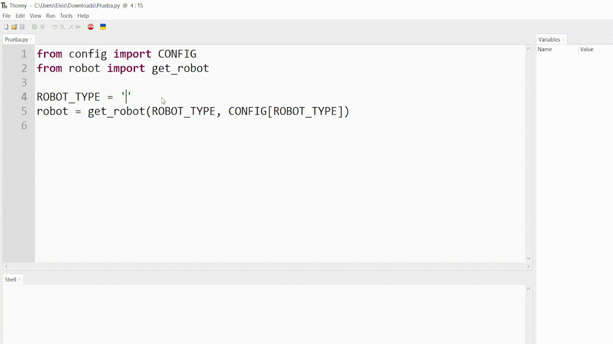
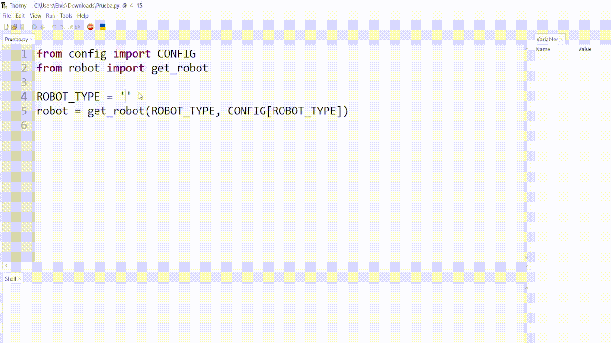

# CONFIGURACIONES INICIALES

## Librería `CONFIG`

La librería `CONFIG` contiene la configuración de hardware para diferentes tipos de robots. Cada tipo tiene su propia estructura, que detalla los motores, sensores y periféricos necesarios para operar correctamente.

### 📦 Diccionario de configuración

!!! abstract "CONFIG: Diccionario centralizado"

    El diccionario `CONFIG` se utiliza para definir y seleccionar configuraciones predeterminadas de hardware. Las claves representan diferentes perfiles de robot.

    Puedes acceder a una configuración específica así:

    ```python
    from config import CONFIG

    ROBOT_TYPE = "mecanum"
    config_actual = CONFIG[ROBOT_TYPE]
    ```

### 🧩 Configuraciones disponibles

!!! info "CONFIG[\"mecanum\"] – Robot omnidireccional completo"

    Configura un robot con 4 ruedas mecanum y sensores integrados.

    - Control individual de 4 motores con PWM, dirección y encoders.
    - 3 sensores ultrasónicos conectados a entradas analógicas (ADC).
    - Sensor IMU conectado por I2C.

<figure markdown="span" align="center">
  { width="450" }
  <figcaption><em><strong>Imagen:</strong> Robot mecanum con 4 ruedas omnidireccionales.</em></figcaption>
</figure>

!!! info "CONFIG[\"arm\"] – Brazo robótico (4DOF)"

    Configura un brazo robótico de 4 grados de libertad.

    - 4 servomotores para articulaciones.
    - Salida de control para efector final.
    - Sensor ultrasónico para percepción frontal.

<figure markdown="span" align="center">
  { width="450" }
  <figcaption><em><strong>Imagen:</strong> Brazo robótico de 4DOF.</em></figcaption>
</figure>

!!! info "CONFIG[\"sensors\"] – Sensores independientes"

    Configuración para usar solo los sensores del sistema.

    - 3 sensores ultrasónicos por ADC.
    - IMU conectada vía I2C.

---