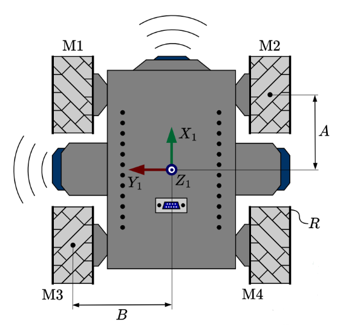

# Configuración y Calibración de Motores

Ya tienes los archivos base en tu Pico W. El siguiente paso, y uno de los más importantes, es asegurar que cada motor de tu robot gire en la dirección correcta. Esta guía te enseñará a diagnosticar y corregir el comportamiento de cada motor de forma individual.

!!! note "Requisitos"
    - Haber completado la **[Guía 3: Carga de archivos base](base_guide.md)**.
    - Tu placa **Raspberry Pi Pico W** conectada a la computadora y con los archivos del proyecto ya cargados.
    - El editor **Thonny** abierto y conectado a la Pico.

---

### Paso 1: Entender los Archivos de Configuración

El firmware separa la configuración en dos archivos para proteger el hardware y darte flexibilidad.

1.  **`config.py`**: Es la configuración base del hardware (pines, etc.). **Este archivo NO debes modificarlo.**
2.  **`student_config.py`**: Este es **tu archivo de configuración personal**. Aquí realizarás todos los ajustes.

Dentro de `student_config.py` puedes usar dos parámetros para cada motor:
-   `"inverted": True`: Invierte la **dirección de giro físico** del motor.
-   `"encoder_inverted": True`: Invierte la **lectura del sensor de giro (encoder)**, sin afectar el movimiento físico.

!!! danger "Advertencia Importante"
    La modificación incorrecta de archivos puede causar un comportamiento inesperado. Realiza todos los cambios **exclusivamente en `student_config.py`**.

---

### Paso 2: Preparar el Script de Diagnóstico

Usaremos un script preparado para probar cada motor de forma aislada.

1.  En Thonny, asegúrate de tener visible el panel de archivos (`Ver > Archivos`).
2.  En el panel de **"Este equipo"** (tu computadora), navega hasta el directorio del proyecto y abre la carpeta `student_examples`.
3.  Localiza y haz doble clic en el archivo `1_test_wheel_direction.py` para abrirlo en el editor.

    <figure markdown="span" align="center">
      { width="600" }
      <figcaption><em><strong>Imagen:</strong> Localizando el script de prueba en el explorador de archivos de Thonny.</em></figcaption>
    </figure>

4.  Dentro del script, busca la línea final que llama a la función `test_wheel_direction()`. Para empezar, asegúrate de que esté probando el primer motor, cambiando el parámetro a `motor_id=0`.

    ```python
    # Al final del archivo 1_test_wheel_direction.py
    test_wheel_direction(robot, motor_id=0)
    ```

---

### Paso 3: Ejecutar la Prueba y Aplicar Correcciones

Este es el ciclo principal: ejecutar la prueba, observar el resultado y corregir si es necesario.

1.  **Ejecuta el script** presionando el botón de Play (▶) en Thonny.
2.  **Observa** atentamente el comportamiento de la rueda del motor 0 y la información que aparece en la consola de Thonny.
3.  **Compara** lo que ves con los siguientes casos y aplica la corrección correspondiente.

#### Caso A: Funcionamiento Correcto ✅
- **Observación:** La rueda gira hacia adelante, luego hacia atrás. La consola muestra una lectura positiva del encoder al avanzar.
- **Acción:** ¡Perfecto! No necesitas hacer nada. Pasa a probar el siguiente motor (`motor_id=1`).

<figure markdown="span" align="center">
  { width="450" }
  <figcaption><em><strong>Imagen:</strong> Comportamiento esperado del motor.</em></figcaption>
</figure>

#### Caso B: Motor con Giro Invertido 🔄
- **Observación:** La rueda gira en la dirección opuesta a la esperada (hacia atrás cuando debería ir hacia adelante).
- **Acción:**
    1. En el panel de archivos de la **Raspberry Pi Pico**, abre el archivo `/config/student_config.py`.
    2. Añade `"inverted": True` al diccionario del motor que estás probando.
    3. Guarda el archivo (`Ctrl+S`) y vuelve a ejecutar la prueba para confirmar que el problema está resuelto.
    ```python
    # En student_config.py
    MOTOR_DIRECTION = [
        {"inverted": True}, # Corrección para el Motor 0
        #...
    ]
    ```

<figure markdown="span" align="center">
  { width="450" }
  <figcaption><em><strong>Imagen:</strong> El motor gira en sentido contrario.</em></figcaption>
</figure>

#### Caso C: Lectura del Encoder Invertida 📈📉
- **Observación:** El movimiento físico de la rueda es correcto, pero la consola muestra una lectura con signo contrario (p. ej., negativa al avanzar).
- **Acción:**
    1. Abre `/config/student_config.py` en tu **Pico**.
    2. Añade `"encoder_inverted": True` al diccionario del motor correspondiente.
    3. Guarda y vuelve a ejecutar la prueba para verificar que la lectura ahora es correcta.
    ```python
    # En student_config.py
    MOTOR_DIRECTION = [
        {"encoder_inverted": True}, # Corrección para el Motor 0
        #...
    ]
    ```

---

### Paso 4: Verificación Final

Una vez que el primer motor funcione correctamente, repite el **Paso 3** para todos los demás motores de tu robot (`motor_id=1`, `motor_id=2`, etc.).

Al finalizar, tu archivo `student_config.py` contendrá la configuración personalizada para tu robot. Podría verse así:

```python
# Ejemplo de una configuración final para un robot de 4 ruedas
MOTOR_DIRECTION = [
    {},                          # Motor 0: Operaba correctamente.
    {"inverted": True},          # Motor 1: Requería inversión de giro.
    {"encoder_inverted": True},  # Motor 2: Solo el encoder estaba invertido.
    {"inverted": True},          # Motor 3: Requería inversión de giro.
]
```

---

!!! success "¡Calibración Completada!"
    ¡Excelente trabajo! Has finalizado la calibración de los motores. Tu robot ahora responde con precisión y está listo para los laboratorios de movimiento y control.