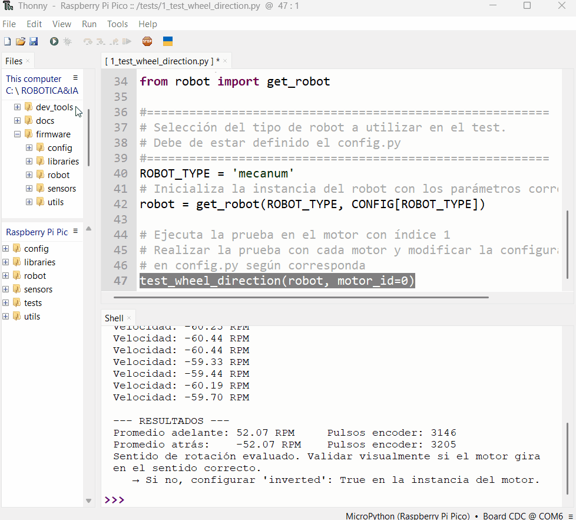

# Configuración y Calibración de Motores

Ya tienes los archivos base en tu Pico W. El siguiente paso, y uno de los más importantes, es asegurar que cada motor de tu robot gire en la dirección correcta y que sus sensores de giro (encoders) lean correctamente. Esta guía te enseñará a diagnosticar y corregir el comportamiento de cada motor de forma individual.

!!! note "Requisitos"
    *   Haber completado la **[Guía 3: Carga de archivos base](../guides/base_guide.md)**.
    *   Tu placa **Raspberry Pi Pico W** conectada a la computadora y con los archivos del proyecto ya cargados.
    *   El editor **Thonny** abierto y conectado a la Pico.

---

### Paso 1: Entender los Archivos de Configuración

El firmware separa la configuración en dos archivos para proteger el hardware y darte flexibilidad:

1.  **`config.py`**: Contiene la configuración base del hardware (pines, etc.). **Este archivo NO debes modificarlo.**
2.  **`student_config.py`**: Este es **tu archivo de configuración personal**. Aquí realizarás todos los ajustes para tu robot específico.

Dentro de `student_config.py`, puedes usar dos parámetros para cada motor para ajustar su comportamiento:

*   `"inverted": True`: Invierte la **dirección de giro físico** del motor. Si el motor debería girar hacia adelante pero gira hacia atrás, esta es la opción a usar.
*   `"encoder_inverted": True`: Invierte la **lectura del sensor de giro (encoder)**, sin afectar el movimiento físico del motor. Si el motor gira correctamente pero la consola muestra lecturas de posición incorrectas (por ejemplo, negativas cuando debería ser positivas), esta es la opción a usar.

!!! danger "Advertencia Importante"
    La modificación incorrecta de archivos puede causar un comportamiento inesperado o dañar el hardware. Realiza todos los cambios **exclusivamente en `student_config.py`**.

Aquí tienes un esquema visual de los motores en un kit robótico para referencia:
<figure markdown="span" align="center">
  { width="450" }
  <figcaption><em><strong>Imagen:</strong> Esquema de motores</em></figcaption>
</figure>

---

### Paso 2: Preparar el Script de Diagnóstico

Utilizaremos un script predefinido para probar cada motor de manera aislada.

1.  En Thonny, asegúrate de que el panel de archivos esté visible. Puedes activarlo desde el menú `Ver > Archivos`.
2.  En el panel de **"Este equipo"** (que representa tu computadora), navega hasta el directorio donde tienes guardado tu proyecto. Abre la carpeta `student_examples`.
3.  Busca el archivo `1_test_wheel_direction.py`. Haz doble clic en él para abrirlo en el editor de Thonny.
4.  Desplázate hasta el final del script. Verás una línea que llama a la función `test_wheel_direction()`. Para empezar la prueba, asegúrate de que esté configurada para probar el primer motor. Modifica el parámetro `motor_id` a `0`:

    ```python
    # Al final del archivo 1_test_wheel_direction.py
    test_wheel_direction(robot, motor_id=0) # motor_id va de 0 a 3, asumiendo 4 motores.
    ```

    La siguiente imagen muestra cómo ejecutar este script y dónde encontrar la línea a modificar:
    <figure markdown="span" align="center">
      { width="550" }
      <figcaption><em><strong>Imagen:</strong> Ejecutando el archivo 1_test_wheel_direction.py</em></figcaption>
    </figure>

---

### Paso 3: Ejecutar la Prueba y Aplicar Correcciones

Este es el ciclo principal de diagnóstico: ejecutar la prueba, observar el comportamiento y aplicar las correcciones necesarias en `student_config.py`.

1.  **Ejecuta el script** presionando el botón de "Play" (▶) en la barra de herramientas de Thonny.
2.  **Observa atentamente** el movimiento de la rueda correspondiente al `motor_id` que estás probando, y lee la información que aparece en la consola de Thonny.
3.  **Compara** lo que observas con los siguientes casos para determinar la corrección adecuada.

    Aquí tienes una demostración visual de la prueba en acción:
    <figure markdown="span" align="center">
      { width="550" }
      <figcaption><em><strong>Imagen:</strong> Comportamiento del robot durante la prueba del motor_id=0</em></figcaption>
    </figure>

#### Caso A: Funcionamiento Correcto ✅

*   **Observación:** La rueda gira primero hacia adelante y luego hacia atrás. En la consola, las lecturas del encoder son **positivas** cuando el motor avanza y **negativas** cuando retrocede.
*   **Acción:** ¡Excelente! El motor funciona correctamente. No necesitas hacer ninguna modificación en `student_config.py` para este motor. Pasa a probar el siguiente motor cambiando el `motor_id` a `1`.

#### Caso B: Motor con Giro Físico Invertido 🔄

*   **Observación:** La rueda gira en la dirección opuesta a la esperada (por ejemplo, gira hacia atrás cuando debería ir hacia adelante). Las lecturas del encoder, sin embargo, son consistentes con el movimiento deseado (positivas al intentar avanzar, negativas al intentar retroceder).
*   **Acción:**
    1.  Abre el archivo `/config/student_config.py` en Thonny.
    2.  Localiza la lista `MOTOR_DIRECTION`. Si no existe, créala.
    3.  Para el motor que estás probando (por ejemplo, el motor 0), añade la entrada `{"inverted": True}` a su diccionario. Si ya hay otras configuraciones, asegúrate de mantenerlas.
    4.  Guarda el archivo (`Ctrl+S` o `Cmd+S`).
    5.  Vuelve a ejecutar el script `1_test_wheel_direction.py` (asegurándote de que el `motor_id` sea el correcto) para confirmar que el problema se ha resuelto.

    ```python
    # Ejemplo de modificación en student_config.py
    MOTOR_DIRECTION = [
        {"inverted": True},  # Corrección para el Motor 0
        # ... entradas para otros motores
    ]
    ```

#### Caso C: Lectura del Encoder Invertida 📈📉

*   **Observación:** El movimiento físico de la rueda es correcto (gira hacia adelante cuando se espera que avance), pero la consola muestra una lectura del encoder con el signo contrario (por ejemplo, lecturas **negativas** al avanzar y **positivas** al retroceder).
*   **Acción:**
    1.  Abre el archivo `/config/student_config.py` en Thonny.
    2.  Localiza la lista `MOTOR_DIRECTION`.
    3.  Para el motor que estás probando, añade la entrada `{"encoder_inverted": True}` a su diccionario.
    4.  Guarda el archivo y vuelve a ejecutar la prueba para verificar que la lectura del encoder ahora sea correcta.

    ```python
    # Ejemplo de modificación en student_config.py
    MOTOR_DIRECTION = [
        {"encoder_inverted": True},  # Corrección para el Motor 0
        # ... entradas para otros motores
    ]
    ```

#### Caso D: Giro Físico Invertido Y Lectura del Encoder Invertida

*   **Observación:** La rueda gira en la dirección opuesta a la esperada (hacia atrás cuando debería ir hacia adelante), Y las lecturas del encoder también son incorrectas (negativas al intentar avanzar, positivas al intentar retroceder).
*   **Acción:**
    1.  Abre el archivo `/config/student_config.py`.
    2.  Añade ambas configuraciones al diccionario del motor correspondiente: `{"inverted": True, "encoder_inverted": True}`.
    3.  Guarda y verifica la corrección ejecutando el script de prueba.

    ```python
    # Ejemplo de modificación en student_config.py
    MOTOR_DIRECTION = [
        {"inverted": True, "encoder_inverted": True},  # Corrección para el Motor 0
        # ... entradas para otros motores
    ]
    ```

---

### Paso 4: Verificación Final

Una vez que hayas corregido el primer motor y confirmado que funciona correctamente, repite el **Paso 3** para todos los demás motores de tu robot (`motor_id=1`, `motor_id=2`, `motor_id=3`, etc.).

Al finalizar este proceso, tu archivo `student_config.py` contendrá la configuración personalizada y precisa para tu robot, asegurando que cada motor opere de la manera esperada.

Un ejemplo de cómo podría verse tu `student_config.py` final para un robot de 4 ruedas, después de haber aplicado las correcciones necesarias, sería:

```python
# Ejemplo de una configuración final para un robot de 4 ruedas
MOTOR_DIRECTION = [
    {},                          # Motor 0: Operaba correctamente.
    {"inverted": True},          # Motor 1: Requería inversión de giro físico.
    {"encoder_inverted": True},  # Motor 2: Solo el encoder estaba invertido.
    {"inverted": True, "encoder_inverted": True}, # Motor 3: Giro y encoder invertidos.
]
```

---

!!! success "¡Calibración Completada!"
    ¡Felicidades! Has completado con éxito la calibración de los motores de tu robot. Con esta configuración precisa, tu robot está listo para responder con exactitud en los próximos laboratorios de movimiento y control.