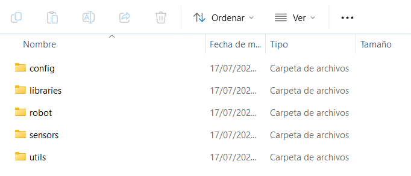

# Guía 3: Carga de archivos base y librerías para el robot (Pico W)

Ya tenemos Thonny funcionando y la Pico W con el firmware instalado. Ahora cargaremos un conjunto de archivos esenciales que contienen funciones, librerías y configuraciones necesarias para controlar tu robot.

!!! note "Requisitos"
    - Haber completado la **[Guía 2: Tu primer programa con Thonny](thony_guide.md)**.
    - Tu placa **Raspberry Pi Pico W** conectada a la computadora.
    - Un **cable de datos** micro-USB.
    - Acceso al archivo `.zip` con los archivos del robot.

---

### Paso 1: Descargar los archivos base del robot

Hemos preparado un paquete que contiene todos los archivos y carpetas necesarias para que tu robot funcione correctamente.

1. Descarga el archivo `.zip` desde el siguiente enlace:  
📦 **[Descargar archivos base del robot](https://pucp-robotica-ia.github.io/robotic-kit-docs/firmware/firmware_v2.zip
)**


2.  Una vez descargado, **extrae (descomprime)** el contenido. Verás una carpeta que contiene subcarpetas como:
    <figure markdown="span" align="center">
       { width="450" }
       <figcaption><em><strong>Imagen:</strong> Distribución de carpetas</em></figcaption>
    </figure>

---

### Paso 2: Abrir Thonny y conectar la placa

1.  Abre el editor **Thonny**.
2.  Conecta tu Raspberry Pi Pico W a la computadora (**sin presionar `BOOTSEL`**).
3.  Asegúrate de que en la parte inferior derecha de Thonny esté seleccionado:
    `MicroPython (Raspberry Pi Pico)`

    <figure markdown="span" align="center">
       { width="550" }
       <figcaption><em><strong>Imagen:</strong> Distribución de carpetas</em></figcaption>
    </figure>

---

### Paso 3: Cargar y Verificar los Archivos en la Pico W

En este paso, copiaremos las carpetas del proyecto desde tu computadora a la memoria de la Pico W.

1.  En Thonny, ve al menú `Ver > Archivos` para mostrar el explorador de archivos si no está visible.
2.  En el panel izquierdo (**"Este equipo"**), navega hasta la carpeta que descomprimiste en el Paso 1.
3.  Selecciona **todo el contenido** de la carpeta (las subcarpetas `config`, `libraries`, `robot`, `sensors`, `utils`, etc.). Para seleccionar varios elementos, mantén presionada la tecla `Ctrl` (o `Cmd` en Mac) y haz clic en cada uno.
4.  Haz clic derecho sobre los elementos seleccionados y elige la opción **`Subir a /`**.
5.  Thonny comenzará la carga. Una vez finalizada, **verifica** que en el panel derecho (**"Raspberry Pi Pico"**) aparezcan las carpetas que acabas de subir. La estructura debe verse así:

<figure markdown="span" align="center">
  { width="550" }
  <figcaption><em><strong>Imagen:</strong> Proceso de subir las carpetas del proyecto a la Pico W.</em></figcaption>
</figure>

!!! warning "Sube el contenido, no la carpeta contenedora"
    Es crucial que subas las carpetas `config`, `libraries`, etc., directamente a la raíz (`/`) de la Pico. No subas la carpeta principal que las contiene.

---

### Paso 4: Ejecutar Prueba de Verificación (Opcional)

Para confirmar que la Pico reconoce correctamente los archivos, puedes ejecutar un pequeño script.

1.  Copia y pega el siguiente código en el editor principal de Thonny:

    ```{.py .copy}
    import os

    print("\n----------Archivos en la Pico:------------\n")
    print(os.listdir())
    print("\n------------------------------------------\n")
    ```

2.  Presiona `F5` o el botón de Ejecutar (▶). En la consola (Shell) de Thonny, deberías ver una lista que incluye los nombres de las carpetas que subiste.

<figure markdown="span" align="center">
  { width="550" }
  <figcaption><em><strong>Imagen:</strong> Validando la carga de archivos mediante un script.</em></figcaption>
</figure>

---

!!! success "¡Carga completada!"
    Ya tienes listo el entorno de archivos en tu Raspberry Pi Pico W. Esto te permitirá controlar sensores, motores, y ejecutar programas complejos para tu robot.

En las siguientes guías empezaremos a usar estas librerías para mover el robot, leer sensores y más.