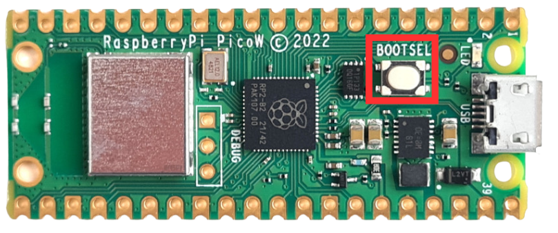
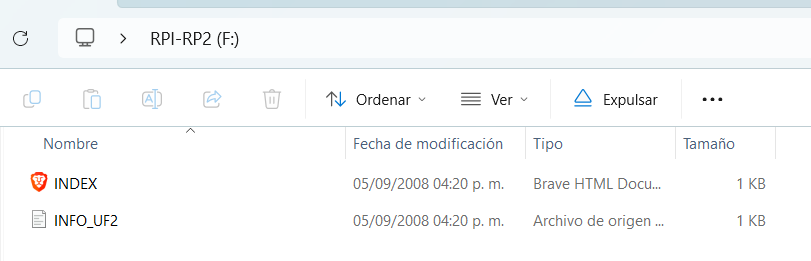

# Guía de instalación del firmware

Sigue estos tres pasos para preparar tu placa **Raspberry Pi Pico W** para el laboratorio.

!!! note "Requisitos"
    -  Una placa **Raspberry Pi Pico W**.
    -  Un **cable de datos** micro-USB.
    -  El editor **[Thonny IDE](https://thonny.org/)** instalado.

---

### Paso 1: Descargar el firmware

Primero, obtén el archivo de firmware oficial de MicroPython, descargar la última versión del firmware.[ **Firmware MicroPython para Pico W (.uf2)**](https://www.micropython.org/download/RPI_PICO_W/)

Guarda este archivo en tu escritorio o en un lugar fácil de encontrar.

---

### Paso 2: Instalar el firmware en la placa

Ahora, vamos a "flashear" el firmware en la memoria del Pico.

1.  **Mantén presionado** el botón **`BOOTSEL`** de tu Pico.

<figure markdown="span" align="center">
  { width="450" }
  <figcaption><em><strong>Imagen:</strong> Botón BOOTSEL</em></figcaption>
</figure>

2.  **Sin soltarlo**, conecta el Pico a tu computadora.
3.  Aparecerá una unidad llamada `RPI-RP2`. Ahora **suelta** el botón `BOOTSEL`.

<figure markdown="span" align="center">
  { width="450" }
  <figcaption><em><strong>Imagen:</strong> Unidad RPI-RP2</em></figcaption>
</figure>
!
4.  **Arrastra y suelta** el archivo `.uf2` que descargaste sobre esa unidad `RPI-RP2`.

!!! success "¡Firmware Instalado!"
    La placa se reiniciará sola y la unidad `RPI-RP2` desaparecerá de tu explorador de archivos. Esto es normal y significa que la instalación fue exitosa.

---

### ¡Listo!

Tu placa ya tiene MicroPython instalado. Ahora estás listo para continuar con la siguiente guía: **[programarla usando Thonny](thony_guide.md)**.