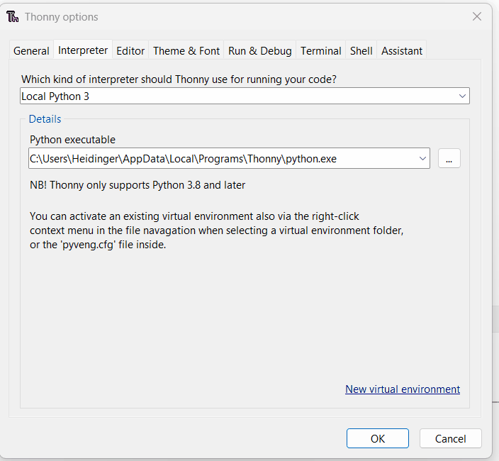
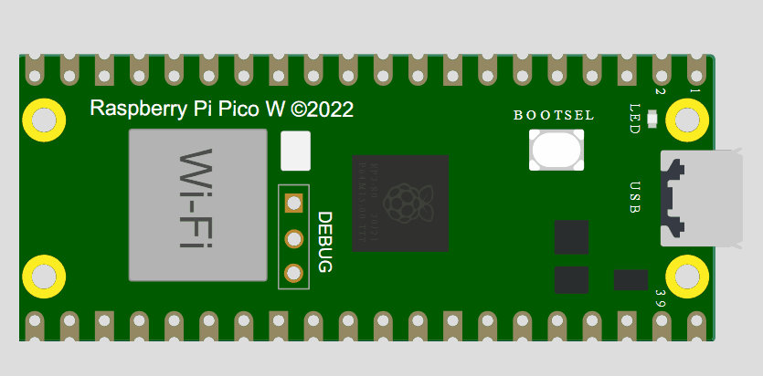
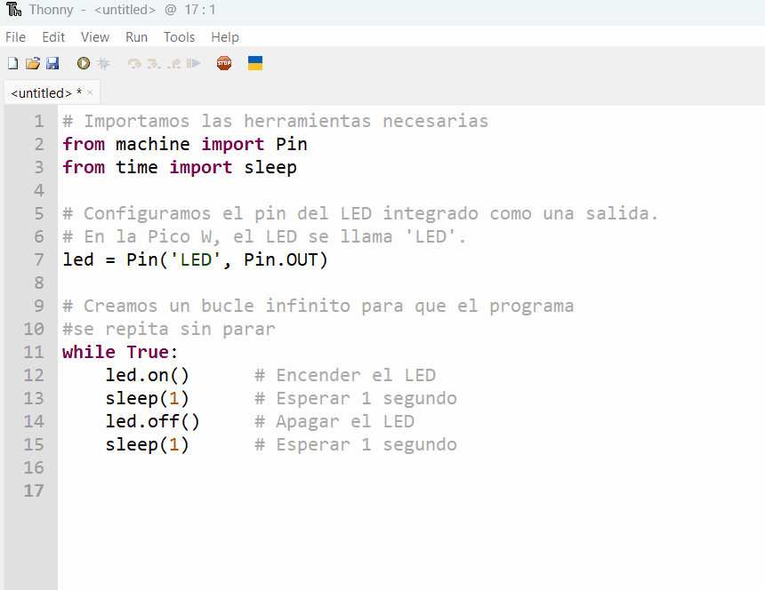

# Guía 2: Tu primer programa con Thonny

Ahora que tu placa tiene el firmware, vamos a comprobar que todo funciona correctamente. Para ello, instalaremos el editor Thonny y ejecutaremos un código que haga parpadear el LED de la placa.

!!! note "Requisitos"
    - Haber completado la **Guía 1: Instalación del Firmware**.
    - Tu placa **Raspberry Pi Pico W** (ya con el firmware).
    - Un **cable de datos** micro-USB.

---

### Paso 1: Instalar el editor Thonny

Thonny es el Entorno de Desarrollo Integrado (IDE) que usaremos. Es perfecto para principiantes porque es sencillo e incluye todo lo necesario para programar la Pico.

1.  Descarga Thonny desde su página oficial: **[https://thonny.org/](https://thonny.org/)**
2.  Instala el programa en tu computadora siguiendo los pasos del asistente.

---

### Paso 2: Conectar la placa a Thonny

1.  Abre **Thonny**.
2.  Conecta tu Raspberry Pi Pico W a la computadora (esta vez de forma normal, **sin presionar `BOOTSEL`**).
3.  En la esquina inferior derecha de Thonny, haz clic y asegúrate de que esté seleccionado el intérprete **`MicroPython (Raspberry Pi Pico)`**. Si no aparece, desconecta y vuelve a conectar la placa.

<figure markdown="span" align="center">
  { width="450" }
  <figcaption><em><strong>Imagen:</strong> Selección del intérprete MicroPython (Raspberry Pi Pico) en Thonny.</em></figcaption>
</figure>

---

### Paso 3: Código de prueba (LED intermitente)

Vamos a escribir y ejecutar nuestro primer programa para verificar la conexión.

1.  Copia el siguiente código y pégalo en la ventana principal del editor de Thonny (donde dice `<untitled>`).

    ```{ .py .copy}
    # Importamos las herramientas necesarias
    from machine import Pin
    from time import sleep

    # Configuramos el pin del LED integrado como una salida.
    # En la Pico W, el LED se llama 'LED'.
    led = Pin('LED', Pin.OUT)

    # Creamos un bucle infinito para que el programa se repita sin parar
    while True:
        led.on()      # Encender el LED
        sleep(1)      # Esperar 1 segundo
        led.off()     # Apagar el LED
        sleep(1)      # Esperar 1 segundo
    ```

2.  Haz clic en el **botón verde de "Play" (▶)** o presiona la tecla **F5** para ejecutar el código.
<figure markdown="span" align="center">
  { width="450" }
  <figcaption><em><strong>Imagen:</strong> LED intermitente</em></figcaption>
</figure>

!!! success "¡Verificación Exitosa!"
    Si todo salió bien, el LED verde integrado en tu Pico W comenzará a **parpadear** (se enciende por un segundo y se apaga por un segundo). ¡Felicidades, has ejecutado tu primer programa!

    Para detenerlo, haz clic en el **botón rojo de "Stop" (■)** en Thonny.

---

### Paso 4 (Opcional pero recomendado): Guardar el código en la placa

Para que tu programa se ejecute automáticamente cada vez que conectes la placa (sin necesidad de una computadora), guárdalo con el nombre `main.py`.

1.  Ve a `Archivo > Guardar como...` (`File > Save as...`).
2.  Elige guardar en **`Raspberry Pi Pico`**.
3.  Nombra el archivo exactamente como **`main.py`** y haz clic en **OK**.

<figure markdown="span" align="center">
  { width="450" }
  <figcaption><em><strong>Imagen:</strong> Guardar código main.py en la raspberry pi pico W</em></figcaption>
</figure>

!!! tip "El poder de `main.py`"
    Cualquier código guardado como `main.py` en la memoria de la Pico se ejecutará automáticamente al encenderla.
